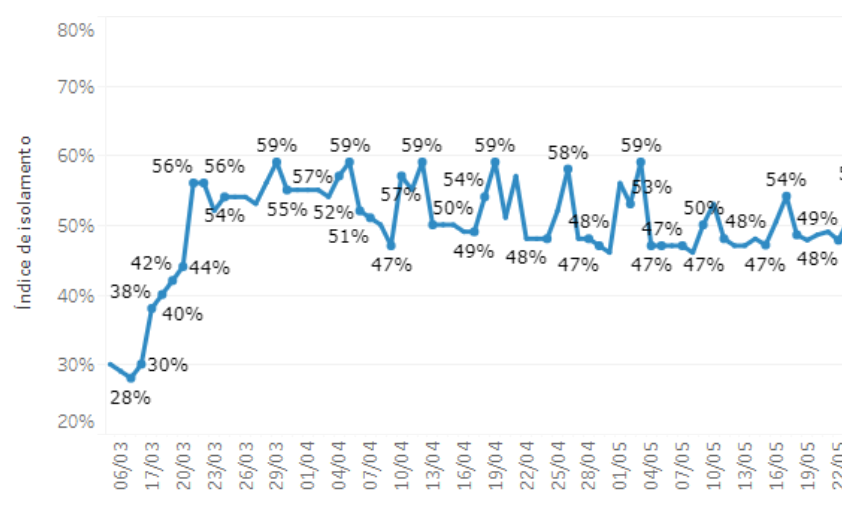
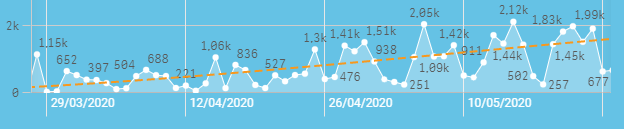
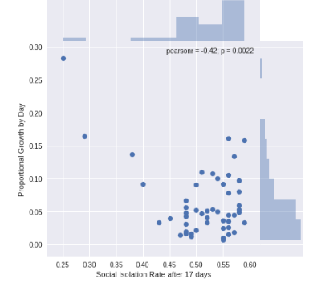

# Cornavirus-SP-City

This case is about the beggining of the spread of coronavirus in the city of São Paulo and why it was so hard at that moment to stopped it and why the city (and also it could reflect all of the country) fail to contain the spread of the vírus.

First of all, assuming that social isolation was the main way to protect ourselves from not getting infected and to manage how fast the contagius is growing and where it is, it’s very importante to test the population and shows the results as fast as it’s possible.

To mesure how good that work was being done it was necessery to cross the countagios rate (how the number of infected people grows compare to the day before) with the social isolate rate, once the are suppost to be correlated.

Looking at the dataset provided by São Paulo town's hall it's easy to undertand how we are testing poorly. And, after search for the correlation with the growth of cases by day and the social isolation rate, the negative correlation with p < 0.1 was 'Social Isolation Rate after 17 days'. Which means the (1) social isolation helps to stop the spread of coronavirus and (2) citizens of São Paulo only can see these effects after 17 days.

